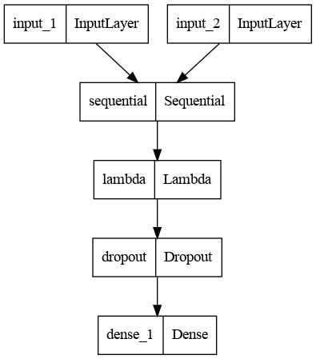

# Face-recognition---Siamese-Network

#### Here a One-shot Siamese Neural Network, using TensorFlow 2.0, based on the work presented by Gregory Koch, Richard Zemel, and Ruslan Salakhutdinov. As specified, we used the “Labeled Faces in the Wild” dataset with over 5,700 different people. Some people have a single image, while others have dozens. We used, as requested, the improved dataset where the faces were aligned automatically using specialized software.

<h3>1) Dataset</h3>
<ul>
  <li>Data is being downloaded from the Labelled Faces In The Wild -> <a href = "https://drive.google.com/u/0/uc?id=1p1wjaqpTh_5RHfJu4vUh8JJCdKwYMHCp&export=download">link</a></li>
  <li>Train and Test ,two text files is being created ,used this for pairs of traning and testing dataset</li>
  <li>For the creation of dataset run the dataloader.ipynb,make sure the test and train filles are placed in the directory as instructed</li>
  <li>As in the Official paper ,the model is trained with (105,105) so make sure the input for the model is of shape(1,105,105,1) at the time of inferance</li>
</ul>

<h3>2) Model architecture</h3>
<ul>
  <li>The implementation is based on the official Siamese paper</li>
  
</ul>
| Layer | Input Size | Filters | Kernel | Maxpooling | Activation Function|
|---| --- | --- | --- |  ---  | --- |
|  1 | 105x105. Reshaped from 250x250 to adhere to the paper. | 64 | 10x10 | Yes, Stride of 2 |ReLU
| 2 | 64 filters of 10x10 | 128 | 7x7 | Yes, Stride of 2 | ReLU |
| 3 | 128 filters of 7x7 | 128 | 4x4 | Yes, Stride of 2 | ReLU |
| 4 | 128 filters of 4x4 | 256 | 4x4 | No | ReLU |
| 5 | 4096x1 Fully connected feature layer with drop out rate of 0.4 (Fraction of the input units to drop) | - | - |No | Sigmoid|

<h3>3)Hyperparameters</h3>

Here im only mentioning the parameters at which the best performance is achieved

<ul>
  <li>Weight initialization: mean = 0,std = 0.01</li>
  <li>learning rate = 0.00005</li>
  <li>Batch size = 32</li>
  <li>No of epochs = 10</li>
</ul>

<h3>4)Final Evaluation</h3>

 Finally real time webcam evaluation is done , it is observed that it is almost predicting good results,but when the two inputs (differant person) is most similiar , model is failing at differanting two images

